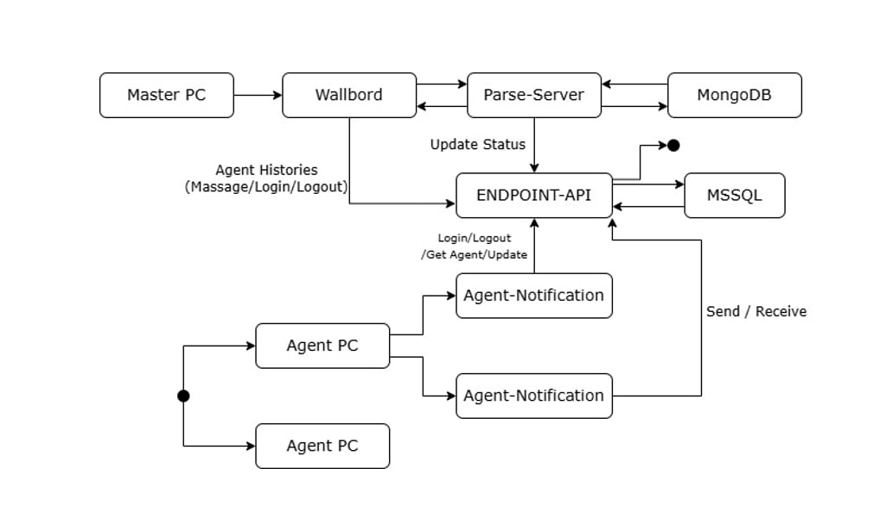

# ENGCE301 - Final LAB Solution

This is our Solution for the Final LAB in ENGCE301 Class team8

## 📋 Overview Web interface

<p align="center">
  
</p>

### view our final lab from here [[ link ]](https://lab-wb.cpe-rmutl.net/team07/#/wallboard)
<br>

# Task

## 📚 API Specification Documentation

📑 [View Complete API Documentation](./Document/README.md)

## ✅ Test Cases

### Agent Notification

| รหัสทดสอบ | รายละเอียดการทดสอบ | ผลลัพธ์ที่คาดหวัง | ผลลัพธ์ |
|-----------|-------------------|-----------------|--------|
| R1.1 | ล็อกอินด้วยชื่อผู้ใช้และรหัสผ่านที่ถูกต้อง | สามารถล็อกอินได้ | [ดูผลลัพธ์](Document/results/1.1.jpg) |
| R1.1 | ล็อกอินด้วยชื่อผู้ใช้หรือรหัสผ่านไม่ถูกต้อง | แสดงข้อความเตือนและปฏิเสธการล็อกอิน | [ดูผลลัพธ์](Document/results/1.2.jpg) |
| R1.2 | ล็อกอินเข้าระบบและตรวจสอบประวัติ | มีการบันทึกเวลาการล็อกอินและล้อกเอาท์ใน AgentLoginHistory | [ดูผลลัพธ์](Document/results/1.2.2.png) |
| R1.3 | ล็อกอินเข้าระบบและตรวจสอบการเปลี่ยนสถานะ | แจ้งเตือนการเปลี่ยนสถานะของ agent | [ดูผลลัพธ์](Document/results/1.3.jpg) |
| R1.4 | ล็อกอินเข้าระบบและตรวจสอบเก็บประวัติการพุดคุย | บันทึกข้อความใน AgentMessageHistory | [ดูผลลัพธ์](Document/results/1.4.png) |


### Agent Wallboard

| รหัสทดสอบ | รายละเอียดการทดสอบ | ผลลัพธ์ที่คาดหวัง | ผลลัพธ์ |
|------------|-------------------|-----------------|--------|
| R2.1 | เข้าหน้า Wallboard และตรวจสอบการแสดงผล   | แสดงสถานะของเอเจนต์ทั้งหมดบน Banner | [ดูผลลัพธ์](Document/results/2.1.png) |
| R2.2 | เข้าหน้าประวัติการใช้งานใน Wallboard   | แสดงข้อมูลประวัติล็อกอิน/ล็อกเอาต์ทั้งหมด | [ดูผลลัพธ์](Document/results/2.2.png) |
| R2.2 | เข้าหน้าประวัติการเปลี่ยนสถานะใน Wallboard   | แสดงข้อมูลการเปลี่ยนสถานะทั้งหมดของเอเจนต์ | [ดูผลลัพธ์](Document/results/2.2.1.png) |
| R2.3 | เข้าหน้าประวัติการพูดคุยใน Wallboard   | แสดงข้อมูลการพูดคุยทั้งหมดระหว่างเอเจนต์ | [ดูผลลัพธ์](Document/results/2.3.png) |

<br><br>

## 📊 Data Flow Diagrams
### ระดับ context
<p align="center">
  
</p>
<br>

## 🗃️ ER Diagrams

<p align="center">
  
</p>
<br>

## 🔄 Activity Flow Diagram
<p align="center">
  
</p>

```
<br>


```markdown
## 👥 Our Team

| นายวรพฤกษ์  พงษปิน| [Github](https://github.com/Worapruk) |
| นายเพิ่มทรัพย์ บัวมั่น | [Github](https://github.com/Poemsup65) |
| นายกฤษดาวุธ  ดีมงคล | [Github](https://github.com/kritsadawut07) |

---
<p align="center">
  <i>Submitted March 2025 • Department of Computer Engineering</i>
</p>